# Design Document

## Overview

This design document outlines a comprehensive testing and validation strategy for the Andreas Vibe business management platform prior to client handoff. The platform is a full-stack Express + React application with multiple business modules including Chat (AI assistant), POS, Marketing, Loyalty, Scheduling, Inventory, and Analytics. The testing strategy encompasses functional testing, performance validation, security assessment, deployment verification, and user acceptance testing to ensure production readiness.

The platform currently has a solid foundation of automated testing including smoke tests, E2E tests, and CI/CD pipeline validation. This design builds upon existing infrastructure while identifying and addressing gaps in test coverage, security validation, and production readiness.

## Architecture

### Testing Infrastructure Components

```mermaid
graph TB
    A[Test Orchestrator] --> B[Functional Testing Suite]
    A --> C[Performance Testing Suite]
    A --> D[Security Testing Suite]
    A --> E[Deployment Testing Suite]
    A --> F[User Acceptance Testing Suite]
    
    B --> B1[API Testing]
    B --> B2[UI Component Testing]
    B --> B3[Integration Testing]
    B --> B4[Business Logic Testing]
    
    C --> C1[Load Testing]
    C --> C2[Response Time Testing]
    C --> C3[Memory Usage Testing]
    C --> C4[Streaming Performance Testing]
    
    D --> D1[Authentication Testing]
    D --> D2[Input Validation Testing]
    D --> D3[Session Security Testing]
    D --> D4[API Security Testing]
    
    E --> E1[Docker Deployment Testing]
    E --> E2[Environment Configuration Testing]
    E --> E3[Database Connectivity Testing]
    E --> E4[Health Monitoring Testing]
    
    F --> F1[Demo Scenario Validation]
    F --> F2[User Workflow Testing]
    F --> F3[Accessibility Testing]
    F --> F4[Browser Compatibility Testing]
```



### Test Environment Architecture

The testing strategy utilizes multiple environments to ensure comprehensive validation:

1. **Local Development Environment**: For unit tests and initial integration testing
2. **Ephemeral Test Environment**: Dynamically created for isolated testing using existing smoke test infrastructure
3. **Staging Environment**: Production-like environment for final validation
4. **Docker Environment**: Containerized testing to validate deployment scenarios

### Existing Testing Infrastructure Analysis

The platform already includes robust testing infrastructure:
- **Smoke Tests**: Comprehensive API endpoint validation, streaming functionality, demo scenarios
- **E2E Tests**: Screenshot generation and visual validation across all modules
- **Navigation Tests**: Sidebar functionality, keyboard shortcuts, state persistence
- **CI/CD Pipeline**: Automated testing on push/PR with Node.js 20, type checking, and build validation

## Components and Interfaces

### Test Orchestrator

**Purpose**: Central coordination of all testing activities
**Interface**: Command-line tool with configuration-driven test execution
**Key Methods**:
- `runTestSuite(suiteType: string, config: TestConfig): TestResult`
- `generateReport(results: TestResult[]): TestReport`
- `validateEnvironment(env: Environment): ValidationResult`

### Functional Testing Suite

**API Testing Component**:
- Extends existing smoke test coverage
- Validates all 25+ API endpoints identified in routes.ts
- Tests error handling, input validation, and response formats
- Includes CSV export functionality testing

**UI Component Testing**:
- React component unit tests using existing Vite/React setup
- Integration with existing shadcn/ui component library
- Accessibility compliance testing
- Mobile responsiveness validation

**Business Logic Testing**:
- POS transaction calculations (tax, discount, totals)
- Inventory management and low stock alerts
- Scheduling conflict detection and staff assignments
- Loyalty points calculation and rewards tracking
- Marketing campaign state management

### Performance Testing Suite

**Load Testing Component**:
- Concurrent user simulation (target: 50-100 concurrent users)
- API endpoint stress testing
- Database query performance under load
- Memory leak detection during extended operation

**Response Time Testing**:
- API endpoint latency measurement (target: <200ms for most endpoints)
- Page load time validation (target: <2s initial load)
- AI chat streaming performance validation
- CSV export performance for large datasets

### Security Testing Suite

**Authentication Testing**:
- Session management validation using existing express-session setup
- Login/logout functionality testing
- Session timeout and security headers validation

**Input Validation Testing**:
- SQL injection prevention (though platform uses in-memory storage primarily)
- XSS prevention in chat and form inputs
- CSRF protection validation
- File upload security (if applicable)

**API Security Testing**:
- Rate limiting validation
- Authentication bypass attempts
- Malicious payload testing
- Environment variable security (OPENAI_API_KEY handling)

### Deployment Testing Suite

**Docker Deployment Testing**:
- Container build and startup validation
- Environment variable configuration testing
- Port binding and networking validation
- Health check endpoint functionality

**Database Connectivity Testing**:
- In-memory storage functionality (default mode)
- PostgreSQL connectivity testing (optional mode)
- Data persistence and migration testing
- Backup and restore procedures

## Data Models

### Test Configuration Model

```typescript
interface TestConfig {
  environment: 'local' | 'staging' | 'docker';
  testSuites: TestSuite[];
  thresholds: PerformanceThresholds;
  security: SecurityConfig;
  reporting: ReportingConfig;
}

interface TestSuite {
  name: string;
  type: 'functional' | 'performance' | 'security' | 'deployment' | 'uat';
  enabled: boolean;
  config: Record<string, any>;
}

interface PerformanceThresholds {
  maxResponseTime: number; // milliseconds
  maxMemoryUsage: number; // MB
  minConcurrentUsers: number;
  maxErrorRate: number; // percentage
}
```

### Test Result Model

```typescript
interface TestResult {
  suiteType: string;
  testName: string;
  status: 'pass' | 'fail' | 'skip';
  duration: number;
  metrics?: PerformanceMetrics;
  errors?: TestError[];
  screenshots?: string[];
}

interface PerformanceMetrics {
  responseTime: number;
  memoryUsage: number;
  cpuUsage: number;
  throughput: number;
}
```

### Test Report Model

```typescript
interface TestReport {
  timestamp: string;
  environment: string;
  summary: TestSummary;
  suiteResults: TestSuiteResult[];
  recommendations: string[];
  readinessScore: number; // 0-100
}

interface TestSummary {
  totalTests: number;
  passed: number;
  failed: number;
  skipped: number;
  coverage: number;
  duration: number;
}
```

## Error Handling

### Test Execution Error Handling

**Test Failure Recovery**:
- Automatic retry mechanism for flaky tests (max 3 retries)
- Environment cleanup after failed tests
- Detailed error logging and screenshot capture
- Graceful degradation for non-critical test failures

**Environment Error Handling**:
- Port conflict resolution (using existing dynamic port allocation)
- Database connection failure handling
- Docker container startup failure recovery
- Network connectivity issue detection

**Reporting Error Handling**:
- Partial report generation on test suite failures
- Error aggregation and categorization
- Critical vs. non-critical error classification
- Automated notification for critical failures

### Security Testing Error Handling

**False Positive Management**:
- Whitelist for known safe patterns
- Context-aware vulnerability assessment
- Manual review process for security findings
- Risk scoring and prioritization

## Testing Strategy

### Phase 1: Foundation Validation (Existing Tests Enhancement)

**Smoke Test Enhancement**:
- Extend existing smoke.ts to include all API endpoints
- Add performance metrics collection
- Include security header validation
- Enhance error scenario testing

**E2E Test Expansion**:
- Add user workflow testing beyond screenshot generation
- Include form submission and data validation
- Test demo scenario transitions
- Validate keyboard shortcuts and accessibility

### Phase 2: Comprehensive Functional Testing

**API Testing**:
- Test all 25+ endpoints identified in routes.ts
- Validate request/response schemas
- Test error conditions and edge cases
- Performance baseline establishment

**Business Logic Testing**:
- POS calculation accuracy testing
- Inventory management workflow testing
- Scheduling conflict resolution testing
- Marketing campaign lifecycle testing
- Loyalty program point calculation testing

### Phase 3: Performance and Security Validation

**Load Testing**:
- Gradual load increase testing (1-100 concurrent users)
- Sustained load testing (30 minutes at target load)
- Spike testing for traffic bursts
- Memory leak detection over extended periods

**Security Assessment**:
- Automated vulnerability scanning
- Manual penetration testing for critical paths
- Code review for security best practices
- Environment configuration security validation

### Phase 4: Deployment and Production Readiness

**Docker Deployment Testing**:
- Multi-environment deployment validation
- Configuration management testing
- Health monitoring and alerting validation
- Rollback procedure testing

**Documentation Validation**:
- Setup instruction accuracy testing
- Troubleshooting guide validation
- User manual completeness review
- API documentation accuracy verification

### Phase 5: User Acceptance Testing

**Demo Scenario Validation**:
- Complete demo script execution
- All preset scenarios functional testing
- User workflow end-to-end validation
- Performance under realistic usage patterns

**Accessibility and Usability**:
- WCAG 2.1 AA compliance testing
- Mobile device compatibility testing
- Browser compatibility testing (Chrome, Firefox, Safari, Edge)
- User interface responsiveness validation

## Testing Tools and Technologies

### Existing Tools (Leverage Current Infrastructure)

**Testing Framework**: Built on existing Node.js/TypeScript infrastructure
**E2E Testing**: Puppeteer (already configured)
**API Testing**: Native fetch API (already in use)
**Build System**: Vite + esbuild (already configured)
**CI/CD**: GitHub Actions (already configured)

### Additional Tools (New Implementations)

**Load Testing**: Artillery.js or k6 for performance testing
**Security Testing**: OWASP ZAP for automated security scanning
**Code Coverage**: c8 or nyc for coverage reporting
**Accessibility Testing**: axe-core for automated accessibility testing
**Visual Regression**: Percy or Chromatic for visual testing

### Monitoring and Reporting

**Test Reporting**: Custom HTML/JSON reports with charts and metrics
**Performance Monitoring**: Integration with existing health endpoint
**Error Tracking**: Structured logging with error categorization
**Metrics Collection**: Performance metrics aggregation and trending

## Success Criteria

### Functional Testing Success Criteria

- 100% of API endpoints tested and passing
- All business logic calculations validated
- Complete user workflow coverage
- Zero critical functional defects

### Performance Success Criteria

- API response times < 200ms for 95th percentile
- Page load times < 2 seconds
- Support for 50+ concurrent users without degradation
- Memory usage stable under sustained load

### Security Success Criteria

- No high or critical security vulnerabilities
- All input validation mechanisms functional
- Session management secure and compliant
- Environment configuration properly secured

### Deployment Success Criteria

- Docker deployment successful in multiple environments
- All configuration options validated
- Health monitoring functional
- Documentation accurate and complete

### User Acceptance Success Criteria

- All demo scenarios execute successfully
- User workflows intuitive and functional
- Accessibility standards met (WCAG 2.1 AA)
- Cross-browser compatibility validated

## Risk Mitigation

### Technical Risks

**Test Environment Instability**: Use existing ephemeral port allocation and cleanup procedures
**Performance Bottlenecks**: Implement gradual load testing with early detection
**Security Vulnerabilities**: Combine automated scanning with manual review
**Integration Failures**: Leverage existing CI/CD pipeline for early detection

### Process Risks

**Timeline Constraints**: Prioritize critical path testing and parallel execution
**Resource Limitations**: Leverage existing infrastructure and tools where possible
**Knowledge Transfer**: Document all procedures and create handoff materials
**Client Expectations**: Regular communication and demonstration of progress

### Mitigation Strategies

**Automated Recovery**: Implement self-healing test procedures
**Parallel Execution**: Run independent test suites concurrently
**Incremental Validation**: Continuous testing throughout development
**Stakeholder Communication**: Regular status updates and issue escalation procedures