# Design Document

## Overview

This design document outlines the systematic approach to resolve all critical issues identified in the client handoff assessment for the Andreas Vibe business management platform. The design addresses three primary categories of blocking issues: security vulnerabilities, performance problems, and user workflow failures. The solution approach prioritizes security fixes first, followed by performance optimization, and concludes with user experience improvements.

## Architecture

### Fix Implementation Strategy

```mermaid
graph TB
    A[Production Readiness Fixes] --> B[Security Hardening]
    A --> C[Performance Optimization]
    A --> D[User Experience Fixes]
    A --> E[Infrastructure Validation]

    B --> B1[Authentication Security]
    B --> B2[Input Validation]
    B --> B3[Environment Security]
    B --> B4[Security Headers]

    C --> C1[Error Rate Reduction]
    C --> C2[Load Handling]
    C --> C3[Resource Management]
    C --> C4[Connection Optimization]

    D --> D1[Loyalty System UI]
    D --> D2[Marketing Workflows]
    D --> D3[E2E Journey Fixes]
    D --> D4[Accessibility Improvements]

    E --> E1[Docker Deployment]
    E --> E2[Monitoring Setup]
    E --> E3[Health Checks]
    E --> E4[Production Config]
```



### Implementation Phases

The fix implementation follows a structured four-phase approach:

1. **Phase 1: Critical Security Fixes** (Priority: CRITICAL)
2. **Phase 2: Performance Optimization** (Priority: HIGH)
3. **Phase 3: User Experience Fixes** (Priority: MEDIUM)
4. **Phase 4: Infrastructure & Validation** (Priority: MEDIUM)

## Components and Interfaces

### Security Hardening Module

**Authentication Security Component**:

- Fix authentication bypass prevention
- Implement proper header validation
- Add comprehensive authentication testing
- Secure session management improvements

**Input Validation Component**:

- Resolve XSS prevention gaps
- Implement comprehensive input sanitization
- Add malicious payload detection
- Create input validation middleware

**Environment Security Component**:

- Audit and fix 7 identified security issues
- Implement secure secrets management
- Add environment variable validation
- Create security configuration guidelines

**Security Headers Component**:

- Add X-Content-Type-Options: nosniff
- Implement X-Frame-Options protection
- Add Strict-Transport-Security headers
- Implement Content Security Policy (CSP)

### Performance Optimization Module

**Error Rate Management Component**:

- Investigate and fix 2.5-2.6% error rate causes
- Implement proper error handling patterns
- Add retry mechanisms with exponential backoff
- Create error monitoring and alerting

**Load Handling Component**:

- Optimize concurrent user handling (50+ users)
- Implement connection pooling
- Add resource management improvements
- Create load balancing strategies

**Resource Optimization Component**:

- Implement memory management improvements
- Add CPU usage optimization
- Create resource monitoring dashboards
- Implement automatic scaling triggers

### User Experience Enhancement Module

**Loyalty System Component**:

- Fix customer selection dropdown issues
- Resolve loyalty points addition workflow
- Improve UI element accessibility
- Add comprehensive loyalty testing

**Marketing Workflow Component**:

- Fix campaign status filter functionality
- Resolve campaign management UI issues
- Improve marketing workflow navigation
- Add marketing feature testing

**End-to-End Journey Component**:

- Fix cross-module workflow issues
- Improve data consistency handling
- Add comprehensive E2E testing
- Create user journey validation

### Infrastructure Validation Module

**Docker Deployment Component**:

- Complete containerized deployment testing
- Fix Docker configuration issues
- Add multi-environment deployment support
- Create deployment automation

**Monitoring and Logging Component**:

- Implement production-ready logging
- Add performance monitoring dashboards
- Create alerting and notification systems
- Add diagnostic and troubleshooting tools

## Data Models

### Fix Tracking Model

```typescript
interface FixItem {
  id: string
  category: 'security' | 'performance' | 'ux' | 'infrastructure'
  priority: 'critical' | 'high' | 'medium' | 'low'
  title: string
  description: string
  status: 'pending' | 'in_progress' | 'testing' | 'completed' | 'blocked'
  assignee?: string
  estimatedHours: number
  actualHours?: number
  dependencies: string[]
  testCriteria: string[]
  validationSteps: string[]
}

interface FixProgress {
  totalFixes: number
  completedFixes: number
  inProgressFixes: number
  blockedFixes: number
  overallProgress: number
  categoryProgress: {
    security: number
    performance: number
    ux: number
    infrastructure: number
  }
}
```

### Validation Model

```typescript
interface ValidationResult {
  fixId: string
  testsPassed: number
  testsFailed: number
  testResults: TestResult[]
  performanceMetrics?: PerformanceMetrics
  securityScore?: number
  readinessScore: number
  blockers: string[]
  recommendations: string[]
}

interface ProductionReadinessStatus {
  overallScore: number
  securityScore: number
  performanceScore: number
  functionalityScore: number
  infrastructureScore: number
  readyForHandoff: boolean
  remainingIssues: FixItem[]
  completedFixes: FixItem[]
}
```

## Error Handling

### Fix Implementation Error Handling

**Regression Prevention**:

- Comprehensive regression testing after each fix
- Automated rollback procedures for failed fixes
- Feature flag implementation for gradual rollouts
- Continuous integration validation

**Fix Validation Error Handling**:

- Automated testing of each implemented fix
- Performance impact assessment
- Security validation for all changes
- User acceptance testing for UX fixes

**Deployment Error Handling**:

- Blue-green deployment strategy
- Automated health checks during deployment
- Rollback procedures for deployment failures
- Monitoring and alerting for production issues

## Implementation Strategy

### Phase 1: Critical Security Fixes (1-2 weeks)

**Week 1: Authentication and Input Security**

- Fix authentication bypass prevention
- Resolve XSS prevention issues
- Implement input validation improvements
- Add comprehensive security testing

**Week 2: Environment and Headers Security**

- Fix environment variable security issues
- Implement security headers
- Add security monitoring
- Complete security validation testing

### Phase 2: Performance Optimization (1 week)

**Days 1-3: Error Rate and Load Handling**

- Investigate and fix error rate causes
- Implement proper error handling
- Optimize concurrent user handling
- Add connection pooling

**Days 4-7: Resource Management and Testing**

- Implement resource management improvements
- Add performance monitoring
- Complete load testing validation
- Optimize resource usage

### Phase 3: User Experience Fixes (3-5 days)

**Days 1-2: Loyalty System Fixes**

- Fix customer selection dropdown
- Resolve loyalty points workflow
- Improve UI accessibility
- Add loyalty system testing

**Days 3-5: Marketing and E2E Fixes**

- Fix marketing campaign filters
- Resolve workflow navigation issues
- Complete end-to-end testing
- Validate user journeys

### Phase 4: Infrastructure & Final Validation (2-3 days)

**Days 1-2: Infrastructure Completion**

- Complete Docker deployment testing
- Implement production monitoring
- Add health check improvements
- Validate deployment procedures

**Day 3: Final Validation**

- Run comprehensive test suite
- Generate updated handoff assessment
- Validate production readiness
- Create final documentation

## Success Criteria

### Security Success Criteria

- Zero critical security vulnerabilities
- All security tests passing (100%)
- Security headers properly implemented
- Environment variables securely managed

### Performance Success Criteria

- Error rate below 1% under all load conditions
- Support for 50+ concurrent users without degradation
- Response times within acceptable thresholds
- Resource usage optimized and stable

### User Experience Success Criteria

- All end-to-end workflows completing successfully
- UI elements properly accessible and functional
- Cross-module data consistency maintained
- User journey validation passing

### Infrastructure Success Criteria

- Docker deployment working in all environments
- Production monitoring and logging functional
- Health checks providing accurate status
- Deployment procedures reliable and documented

### Overall Success Criteria

- Production readiness score ≥ 98%
- Client handoff assessment: GREENLIGHT
- All critical issues resolved and validated
- Comprehensive documentation updated

## Risk Mitigation

### Technical Risks

**Fix Implementation Risks**:

- Risk: Introducing new bugs while fixing existing issues
- Mitigation: Comprehensive regression testing, feature flags, gradual rollouts

**Performance Optimization Risks**:

- Risk: Performance fixes causing functional regressions
- Mitigation: Performance testing with functional validation, monitoring

**Security Fix Risks**:

- Risk: Security changes breaking existing functionality
- Mitigation: Security testing with functional validation, staged deployment

### Process Risks

**Timeline Risks**:

- Risk: Fixes taking longer than estimated
- Mitigation: Parallel development where possible, daily progress tracking

**Quality Risks**:

- Risk: Insufficient testing of implemented fixes
- Mitigation: Automated testing, manual validation, peer review

**Deployment Risks**:

- Risk: Production deployment issues
- Mitigation: Staging environment validation, rollback procedures, monitoring

## Monitoring and Validation

### Fix Progress Monitoring

- Daily progress tracking dashboard
- Automated testing results
- Performance metrics trending
- Security validation status

### Quality Assurance

- Automated regression testing
- Manual validation procedures
- Performance benchmarking
- Security audit validation

### Production Readiness Validation

- Comprehensive test suite execution
- Client handoff assessment update
- Stakeholder review and approval
- Final documentation review
